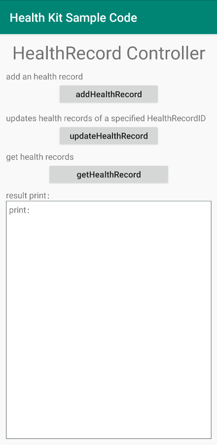

# HMS Healthkit Demo
English | [中文](README_ZH.md)
## Item

 * [Introduction](#Introduction)
 * [Preparations](#Preparations)
 * [Environment Requirements](#Environment-Requirements)
 * [Result](#Result)
 * [Technical Support](#Technical-Support)
 * [License](#License)

## Introduction
HUAWEI Health Kit is the fitness and health capability open service that constructs a fitness and health ecosystem data platform (hereinafter referred to as the ecosystem data platform). As the manager of users' fitness and health data, the ecosystem data platform complies with Huawei's cyber security and user privacy protection specifications to ensure the security, integrity, and accuracy of user data. You can access Huawei's ecosystem data platform by integrating Health Kit. The ecosystem data platform provides APIs for you to write user fitness and health data to the ecosystem data platform, as well as various data query APIs for you to obtain the fitness and health data imported by users across platforms and apps. The ecosystem data platform manages only the fitness and health data authorized by users and provides abundant cross-platform and cross-app query APIs.

This project is the Android sample code of Health Kit. In the sample code, Android APIs of the ecosystem data platform are called to write the user's fitness and health data and read the data written by the user to the platform. The sample code provides only simple calling examples of the Android APIs for your reference.

HUAWEI Health Kit provides the following functions:
(1) Login and authorization
Allows users to log in to their accounts, and obtains the read and write permissions on fitness and health data.
The Android APIs code is saved in **\app\src\main\java\com\huawei\demo\health\auth\HealthKitAuthActivity.java**.

(2) Authorization cancellation
Allows users to cancel account authorization.
The Android APIs code is saved in **\app\src\main\java\com\huawei\demo\health\auth\HealthKitMainActivity.java**.

(3) Fitness and health data management
Supports adding, deleting, updating, and querying authorized health and fitness data.
The code is stored in **\app\src\main\java\com\huawei\demo\health\HealthKitDataControllerActivity.java**.

(4) Automatic record of step counts on the user device
Allows you to add a listener on the pedometer and pass the sensor data in real time as the authorized fitness and health data to your app, under user authorization.
The code is stored in **\app\src\main\java\com\huawei\demo\health\HealthKitAutoRecorderControllerActivity.java**.

(5) Activity record dataset operations
Allows you to write the activity records and fitness and health datasets authorized by the user. For example, a running activity includes a start time, an end time, and exercise data (track, speed, and heart rate).
With user authorization, an activity (such as running) can be created, during which the user's authorized fitness and health data is written to the ecosystem data platform, until the activity ends.
With user authorization, you can manage the user's fitness data, including querying, deleting, and modifying the data.
The code is stored in **\app\src\main\java\com\huawei\demo\health\HealthKitActivityRecordControllerActivity.java**.

(6) Custom data type
Allows you to create customized data types and use them to write the user's fitness and health data to the ecosystem data platform, under user authorization.
You can also cancel a listener added to the ecosystem data platform.
The code is stored in **\app\src\main\java\com\huawei\demo\health\HealthKitSettingControllerActivity.java**.

(7) Health record dataset operations
Allows you to add, modify, and query health records under user authorization. Currently, only the tachycardia and bradycardia data types are supported.
The code is stored in **\app\src\main\java\com\huawei\demo\health\HealthKitHealthRecordControllerActivity.java**.

## Preparations

Before using the sample code, check whether Integrated Development Environment (IDE) has been installed.
1.	Decompress the sample code package.
	.	Copy the code package to the IDE directory and import the code package to the IDE.
3. Generate a signing certificate fingerprint, add the certificate file to your project, and add the signature configuration to the **build.gradle** file. For details, refer to [Development Guide](https://developer.huawei.com/consumer/en/doc/development/HMSCore-Guides/signing-fingerprint-0000001059050363?ha_source=hms1).
	.	Click **Sync Project with Gradle Files** to build the IDE.

Before using the functions in the sample code package, configure the following parameters:
1.	HUAWEI ID: The Health app needs to verify whether you have the permission to read and write health data.
	.	HMS SDK Maven address:
    * 	Go to the project **build.gradle** > **all projects** > **repositories**, configure the Maven address of HMS SDK: **maven {url 'http://developer.huawei.com/repo/'}**.
    * 	Go to the project **build.gradle** > **buildscript** > **dependencies**, configure the Maven address of HMS SDK: **maven {url 'http://developer.huawei.com/repo/'}**.
			**Build dependencies**: Add build dependencies implementation **'com.huawei.hms:health:{version}'** to the **build.gradle** file at the app level.
			**AppId**: Add the app ID generated when creating the app on HUAWEI Developers to the **AndroidManifest.xml** file of the app.

## Get familiar with environment requirements.
* Android Studio 3.6.1 or later
* Java SDK 1.8 or later
* HMS Core (APK) 4.2.0.300 or later has been installed on the phone. To read data from the Health app, HMS Core (APK) 5.0.4.300 or later should be installed.

## Operation Result
         
   
	

## Technical Support
You can visit the [Reddit community](https://www.reddit.com/r/HuaweiDevelopers/) to obtain the latest information about HMS Core and communicate with other developers.

If you have any questions about the sample code, try the following:
- Visit [Stack Overflow](https://stackoverflow.com/questions/tagged/huawei-mobile-services?tab=Votes).
Submit your questions, and tag them with `huawei-mobile-services`. Huawei experts will answer your questions.
- Visit the HMS Core section in the [Huawei Developer Forum](https://forums.developer.huawei.com/forumPortal/en/home?fid=0101187876626530001?ha_source=hms1) and communicate with other developers.

If you encounter any issues when using the sample code, submit your [issues](https://github.com/HMS-Core/hms-health-demo-java/issues) or submit a [pull request](https://github.com/HMS-Core/hms-health-demo-java/pulls).

##  License
   The sample code is licensed under [Apache License 2.0](http://www.apache.org/licenses/LICENSE-2.0).
