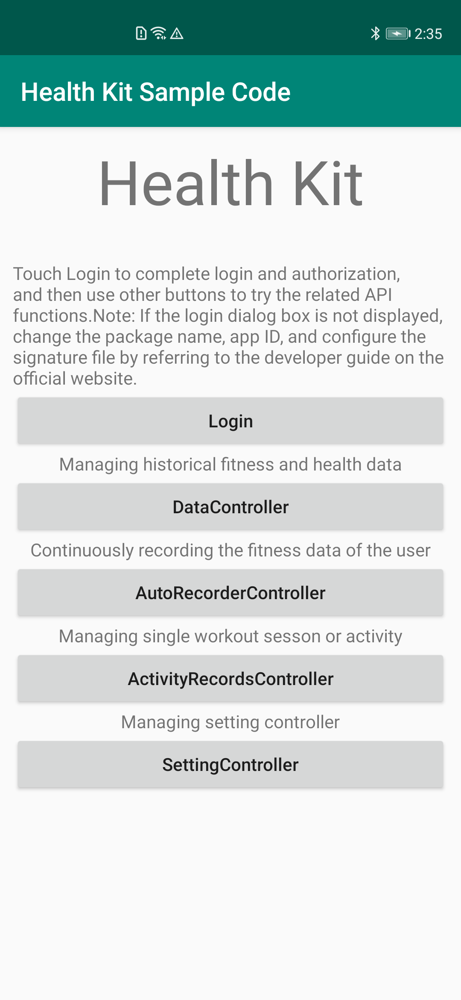
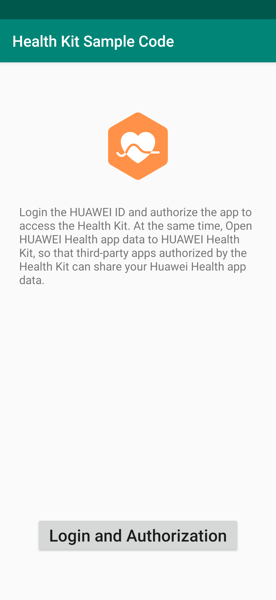
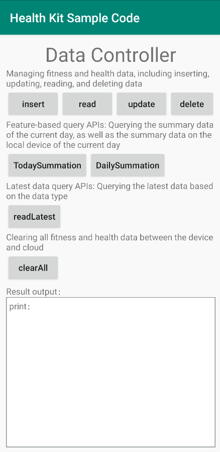
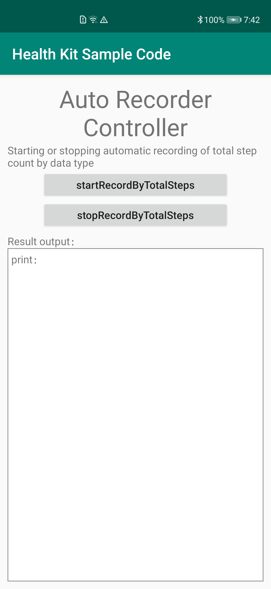
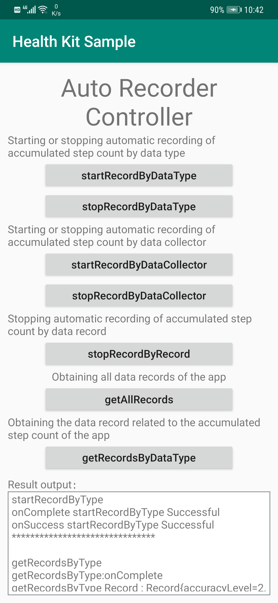
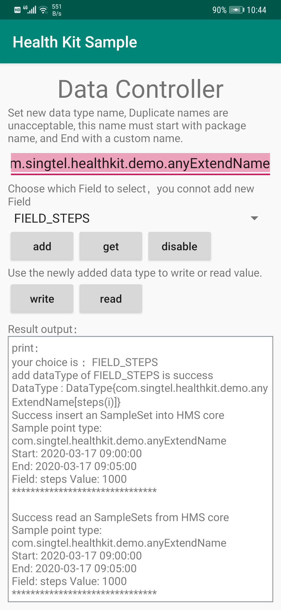

# HMS Healthkit Demo
中文 | [English](https://github.com/HMS-Core/hms-health-demo-java/blob/master/README.md)
## 目录

 * [简介](#简介)
 * [开发准备](#开发准备)
 * [环境要求](#环境要求)
 * [操作结果](#操作结果)
 * [技术支持](#技术支持)
 * [授权许可](#授权许可)

## 简介
华为运动健康服务（HUAWEI Health Kit）是华为提供的运动健康能力开放服务， 构建的是一个开放的运动健康生态数据平台（后面统称生态数据平台）。生态数据平台作为用户运动健康数据的管理者，遵循华为网络安全与用户隐私保护规范，确保用户数据安全、完整、准确。开发者通过集成华为运动健康服务，接入华为生态数据平台。生态数据平台提供给开发者写入用户运动健康数据的接口，开发者通过调用写入数据的接口将用户的运动健康数据导入到生态数据平台。同时生态数据平台提供了丰富的数据查询接口，开发者通过调用查询接口可以跨平台、跨应用获取到用户导入的运动健康数据。生态数据平台只对用户授权导入的运动健康数据进行管理，并提供丰富的跨平台、跨应用查询接口。   

本项目是华为运动健康服务的Android示例代码，示例代码调用了运动健康生态数据平台提供的Android API接口，写入用户的运动健康数据和读取用户写入到生态数据平台中的数据，本示例代码只提供Android API的简单调用，仅供参考或受限使用。   

华为运动健康服务功能如下：  
1) 登录与授权  
支持用户登录账号并获取用户对运动健康数据读写授权。  
Android APIs代码位置:  \app\src\main\java\com\huawei\demo\health\auth\HealthKitAuthActivity.java     

2) 运动健康数据管理  
支持用户对已授权的健康运动数据进行增加/删除/更新/查询等操作。  
代码位置: \app\src\main\java\com\huawei\demo\health\HealthKitDataControllerActivity.java

3)	自动记录用户设备的步数  
支持在用户授权条件下，用户添加对计步器的监听，并将传感器中的数据以用户已授权的运动健康数据类型实时返回给三方。 
代码位置: \app\src\main\java\com\huawei\demo\health\HealthKitAutoRecorderControllerActivity.java

4)	运动记录数据集操作  
支持用户写入运动包含及其全部用户已授权的运动健康数据集，例如一次跑步运动包括跑步的开始时间，结束时间，以及运动数据（轨迹， 速度， 心率）等。  
支持在用户授权条件下，用户创建一个运动（如跑步），然后开启跑步，在跑步过程中将用户授权的运动健康数据写入到生态数据平台，最后结束运动。  
支持在用户授权条件下，管理用户的运动，包括查询，删除，修改运动数据等操作。  
代码位置: \app\src\main\java\com\huawei\demo\health\HealthKitActivityRecordControllerActivity.java  

5)	用户自定义数据类型  
支持在用户授权条件下，开发可以创建自定义的数据类型，并使用自定义的数据类型写入用户的运动健康数据到生态数据平台。  
支持用户取消已经添加到生态数据平台里的监听器。  
代码位置: \app\src\main\java\com\huawei\demo\health\HealthKitSettingControllerActivity.java  

## 开发准备  

使用Health Kit Android示例代码前，请先检查IDE环境是否已安装。 
1.	解压示例代码包。    
2.	将代码包拷贝到IDE目录下，并导入到IDE工具中。    
3.  另外，需要生成签名证书指纹并将证书文件添加到项目中，然后将配置添加到build.gradle。详细信息(https://developer.huawei.com/consumer/en/doc/development/HMSCore-Guides-V5/signing-fingerprint-0000001050071709-V5)
4.	点击Sync Project with Gradle Files完成开发环境构建。    

使用示例代码包中的功能之前，需要设置如下参数：    
1.	华为账号：运动健康需要验证用户是否具有读写健康数据的权限。    
2.	HMS SDK maven地址：
    * 	在项目build.gradle的all projects->repositories中，配置HMS SDK的maven地址：maven {url 'http://developer.huawei.com/repo/' }
    * 	在项目build.gradle的buildscript-> dependencies中，配置HMS SDK的maven配置：maven {url 'http://developer.huawei.com/repo/' }
3.	编译依赖：在app层级的build.gradle文件中增加编译依赖：implementation 'com.huawei.hms:health:{version}'    
4.	AppId信息：在应用的AndroidManifest.xml文件中添加在开发者联盟创建应用时生成的AppId信息。  

## 环境要求
* Android Studio 3.0 及以上版本
* Java SDK 1.8 及以上版本
* HMS Core 4.0.2.300 及以上版本

## 操作结果
      
    
	
## 技术支持
如果您对HMS Core还处于评估阶段，可在[Reddit社区](https://www.reddit.com/r/HuaweiDevelopers/)获取关于HMS Core的最新讯息，并与其他开发者交流见解。

如果您对使用HMS示例代码有疑问，请尝试：
- 开发过程遇到问题上[Stack Overflow](https://stackoverflow.com/questions/tagged/huawei-mobile-services)，在`huawei-mobile-services`
标签下提问，有华为研发专家在线一对一解决您的问题。
- 到[华为开发者论坛](https://developer.huawei.com/consumer/cn/forum/blockdisplay?fid=18) HMS Core板块与其他开发者进行交流。

如果您在尝试示例代码中遇到问题，请向仓库提交[issue](https://github.com/HMS-Core/hms-health-demo-java/issues)，也欢迎您提交[Pull Request](https://github.com/HMS-Core/hms-health-demo-java/pulls)。

##  授权许可
   华为运动健康服务示例代码经过 [Apache License 2.0](http://www.apache.org/licenses/LICENSE-2.0)授权许可。
